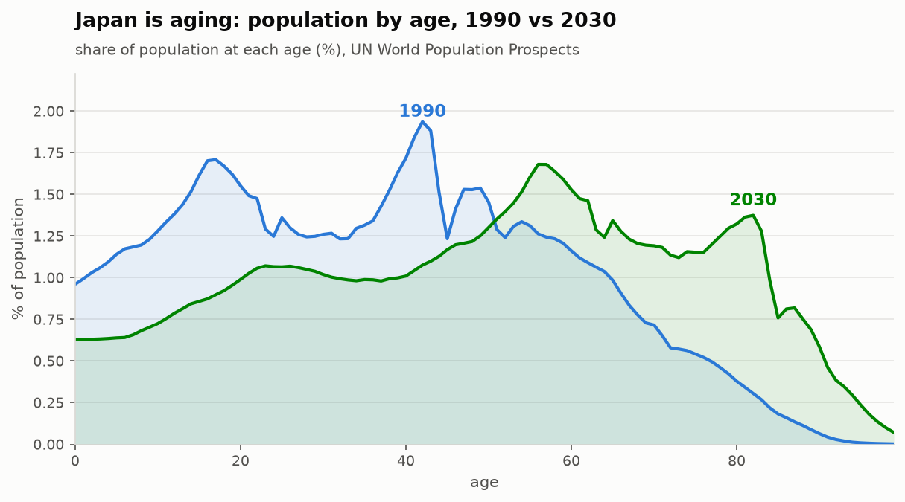

# OG-Japan (OG-JPN)

An overlapping-generations model of Japanese fiscal policy, built on
[OG-Core](https://github.com/PSLmodels/OG-Core). OG-JPN is a country
calibration of OG-Core, in the same family as OG-USA, OG-UK, OG-BRA, and
OG-THA. To our knowledge no open-source OG model of Japan exists yet.

Japan is an unusually important case for this class of model: it has the
oldest population of any large economy and a gross public debt of roughly
250 percent of GDP. Those are exactly the fiscal-demographic dynamics
overlapping-generations models are built to study.



The model runs on this real UN population data, and now on a Japanese
fiscal calibration to match: net debt, Japan's near-zero effective
interest rate, its social-insurance-heavy tax structure, and a
defined-benefit pension system.

## Status

A country model is a thin calibration layer on top of OG-Core that
supplies demographics, macro parameters, earnings profiles, an
input-output structure, and tax parameters. Phase 0 established the
skeleton and de-risked the hardest dependency, demographics. Phases 1
and 2 are now substantially done — see
[docs/CALIBRATION_AUDIT.md](docs/CALIBRATION_AUDIT.md) for what was
found and what each value is sourced from.

The thing to understand about a country port is that **anything the
calibration does not set keeps OG-Core's United States value.** The
calibration now overrides 34 parameters rather than 7, plus the
earnings matrix and the demographic arrays. What is still on US
defaults is listed explicitly in `ogjpn/calibrate.py`, and
[docs/CALIBRATION_TABLE.md](docs/CALIBRATION_TABLE.md) gives every
calibrated value with its source.

**What works:** OG-Core's `demographics` module can pull Japan's
fertility, mortality, and population data from the UN World Population
Prospects data portal using country code `392`. The calibration
pipeline (`ogjpn.calibrate.Calibration` -> `Specifications` -> steady
state solve) is wired and runnable via `examples/run_ogjpn_ss.py`.

**Known prerequisite (data access):** The UN data portal now requires a
free API token. Save it as `un_api_token.txt` in the run directory.
Without a token, OG-Core falls back to an offline data mirror
([EAPD-DRB/Population-Data](https://github.com/EAPD-DRB/Population-Data)),
which currently covers 11 countries but **not Japan**. So live Japan
demographics require the token today.

This also surfaces two clean give-back contributions to the upstream
ecosystem:
1. Add `"392": "JPN"` to the country map in `ogcore/demographics.py`.
2. Contribute Japan's demographic CSVs to `EAPD-DRB/Population-Data` so
   Japan works offline like the other country models.

## What is calibrated to Japan

Every value is sourced in the module that sets it.

| Block | Key values | Source |
|---|---|---|
| Debt | net debt 0.864 of GDP; SS target 1.0 | OECD Economic Outlook GNFLQ |
| Interest | `r_gov` ≈ −0.6% real | OECD net interest ÷ net debt, 2015–2024 |
| Foreign debt | 13.7% foreign-held | MOF JGB/T-Bill holders, Mar 2026 |
| Growth | `g_y` 0.56%/yr, 2000–2019 | World Bank GDP per person employed |
| Social insurance | effective 21.3% of wages (13.2% of GDP) | OECD Revenue Statistics 2025 |
| Income tax | Gouveia-Strauss, top rate 55% | OECD RevStats; Japan statutory schedule |
| Consumption | effective 12.7% (all indirect taxes) | OECD RevStats 2025 |
| Corporate | 29.74% statutory | OECD RevStats 2025 |
| Property / bequest | wealth tax + material inheritance tax | OECD RevStats; MOF FY2025 budget |
| Pension | Defined Benefits, effective 41.4% replacement | OECD Pensions at a Glance 2023 |
| Income anchor | ¥4.6m mean salary | National Tax Agency, 2023 |
| Depreciation | 6.2%/yr | World Bank consumption of fixed capital |
| Capital share | 0.43 | Penn World Table labour share |
| Discount factor | 0.979, calibrated to K/Y = 3.70 | Penn World Table |
| Earnings profile | NTA age shape + Gini tilt to 32.3 | NTA; World Bank |
| Demographics | 20 years of UN projection, not 2 | UN WPP |

Still on OG-Core's US values and documented as such: `chi_n` (the
labour-disutility profile). For Japan that borrow is defensible to within
1% — Japan works 10.5% fewer hours per worker but employs far more people,
so total labour input per working-age person is 1,278 hours against the
US 1,288.

Three limitations found in OG-Core itself are recorded in
[docs/UPSTREAM_OGCORE.md](docs/UPSTREAM_OGCORE.md) rather than worked
around; three of the six items there affect every country repo.

## Roadmap

- **Phase 0 (done):** skeleton + demographics feasibility.
- **Phase 1 (done):** Japanese macro parameters — debt on a net basis, the
  sovereign interest wedge, openness, growth, spending shares.
- **Phase 2 (mostly done):** tax calibration from collections by
  instrument, and a defined-benefit pension system. Japan has no open tax
  microsimulator, so the income tax uses OG-Core's Gouveia-Strauss form fit
  to the statutory schedule and tuned to published collections. Remaining:
  the age-earnings profile tilt.
- **Phase 2b (next):** run the in-model tuning loop. Several parameters can
  only be pinned down against a solved steady state — they are marked
  `NEEDS TUNING` in the source with the target each should hit.
- **Phase 3:** analyze one real policy question (a consumption-tax
  change, a higher retirement age, or a pension reform) and write it up.
- **Phase 4:** documentation, tests, and sharing with the PSL community.

## Layout

```
ogjpn/
  constants.py   country code (392) and metadata
  calibrate.py   Calibration class (demographics wired in Phase 0)
examples/
  run_ogjpn_ss.py   Phase 0 feasibility: load demographics + solve SS
```

## Running the feasibility check

With OG-Core installed in the environment:

```
PYTHONPATH=. python examples/run_ogjpn_ss.py
```

Add `un_api_token.txt` first to use live Japan demographics; otherwise
the script falls back to OG-Core defaults and says so.
