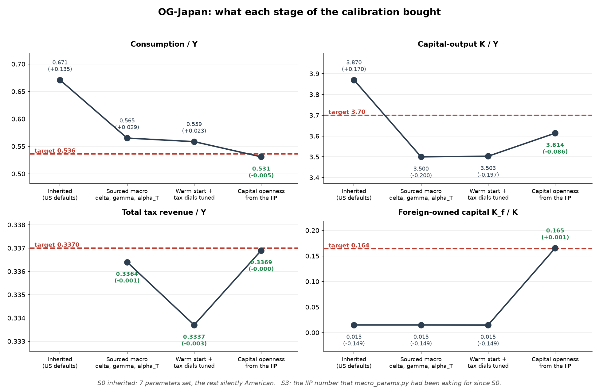

# Calibrating Japan with an AI agent: what actually happened

Source material for a presentation on AI-assisted economic model calibration.
Everything below is drawn from the session record and the git history of this
repository — commit hashes and timestamps are real, the numbers are recorded
solved steady states, and the corrections are the ones that actually had to be
made rather than a tidied-up account.

The short version: an overlapping-generations model of Japan went from a
consumption share 13.5 percentage points wrong to a calibration where total tax
revenue lands within 0.01pp of GDP and the government budget identity closes to
zero. It took about eleven hours, forty-one commits, and — this is the part
worth presenting — **six substantive corrections to the agent's own work**, four
of which the agent found itself and two of which the user's questions forced.

---

## 1. The setup

**The task.** Someone else's repository (`arihantlodha-cmd/OG-JPN`) contained a
working port of OG-Core to Japan. The model ran. The instruction was: *"the best
possible calibration of the japan economy using the og model."*

**What the agent brought.** A `og-country-calibration` skill — roughly 800 lines
of accumulated method and pitfall notes from six previous country calibrations
(USA, Philippines, South Africa, Indonesia, Brazil, Ethiopia). This matters for
the presentation's argument: the agent was not reasoning from first principles.
It was applying a written playbook, and **a large part of the story is the
playbook being wrong.**

**The first real finding, within the first hour.** The repository set seven
parameters. Thirty-four mattered. Everything else silently inherited OG-Core's
United States values — including the depreciation rate, the discount factor, the
corporate tax rate, the pension formula, and `mean_income_data`, which is
denominated in **US dollars** and scales the income at which every tax function
and the pension benefit is evaluated.

That is the headline for a general audience: *the model was producing Japanese
numbers by evaluating American tax law at American income levels.* Nothing
errored. Nothing warned. The output looked like economics.

---

## 2. Timeline

Forty-one commits, all on 2026-08-10. Grouped by what was actually going on.

| Time | Commits | Phase | What happened |
|---|---|---|---|
| 10:22–11:13 | 4 | **First sourced pass** | Macro, tax and pension blocks calibrated from published data. First solved steady state. |
| 11:26–11:46 | 3 | **First self-correction** | Depreciation and capital share re-sourced; `alpha_T` found to be 3× too high; a pension justification found to be wrong and rewritten. |
| 11:59–12:27 | 5 | **Earnings + growth** | Gini tilt, NTA age-shape adjustment, productivity growth re-measured *per hour*, `beta` calibrated to `K/Y`. |
| 13:12–14:09 | 6 | **The stall** | Steady state stops converging. Two hypotheses tried and both reverted. Transition failure recorded. |
| 14:30–16:38 | 6 | **Root-cause hunt** | Demographic window widened 2→74 years. `fixper` identified. Demographic caching. The hardcoded bequest seed found. |
| 17:25–19:03 | 5 | **Breakthrough** | Revert to a known-good state; warm start built; >175 evaluations → 21. Final tuning round. |
| 21:38–21:58 | 7 | **The audit** | Release gate added. Capital openness found. A false claim shipped and corrected. Every remaining marker resolved. |

The shape worth noting: **the productive work is at the ends.** The middle four
hours — 13:12 to 17:25 — produced almost no calibration progress. That period is
section 5, and it is the most instructive part of the story.

---

## 3. What the agent did, mechanically

Useful for an audience that wants to know what "AI-assisted" actually means here.

**Finding sources.** Not from memory — the agent pulled live from: the OECD SDMX
API (government debt series GNFLQ/GGFLQ, primary balance NLGXQ), OECD Revenue
Statistics 2025, the UN World Population Prospects Data Portal API, FRED (Penn
World Table series for labour share, capital stock, hours, persons engaged), the
World Bank WDI, Japan's Ministry of Finance (JGB holder breakdown, and the
International Investment Position), the National Tax Agency, IPSS, and the NTA
(National Transfer Accounts) database.

The NTA fetch is a small illustration of the work involved: it has no API, so it
required establishing a session, POSTing a query to a confirm endpoint, then
POSTing the session-scoped form it returned **with a Referer header** — 403
without one. And the country code for the United States is `"US"`, not
`"United States"`.

**Calculating.** Depreciation was derived, not looked up:
`delta = (CFC/Y)/(K/Y)` from World Bank capital-consumption data over a PWT
capital-output ratio. Productivity growth was computed three ways (per worker,
per hour, hours trend) across four candidate windows. The foreign-owned capital
share was constructed from IIP components. Where a moment could be reproduced
from the model's own equations, it was — and that check caught errors.

**Validating.** A dashboard script (`examples/validate_japan.py`) that solves the
steady state and scores every moment against a sourced target with the source
printed next to it. Plus 32 tests, including one that applies the whole
calibration to a real `Specifications` object — which catches type and range
errors that otherwise only appear at solve time.

**A representative catch:** `delta_annual` was set to `[0.062]`. It is a scalar,
not a list. The model accepted it at configuration time and raised a
ValidationError minutes later, mid-solve. The fix was one character; the lesson
was a test that exercises the whole parameter set against the real validator.

---

## 4. The corrections — the honest list

This is the section the presentation should probably lead with, because it is
the part that is usually omitted.

### 4.1 The debt figure the agent asserted without checking

The user was asked whether to model gross or net debt, with the options
pre-filled from the agent's estimate: *"Net debt, ~1.3–1.5× GDP."* The user
picked net.

**The number was wrong.** Japan's actual net financial liabilities at end-2024
(OECD GNFLQ) are **86.4% of GDP**, not 130–150%. The agent had stated a figure
with confidence, embedded it in a multiple-choice question that made it look
verified, and only discovered the error when it later pulled the OECD series
directly.

For the presentation: **the failure mode is not hallucination in the obvious
sense.** It is a plausible number presented in a format that implies it was
checked. The user's decision was made on it.

### 4.2 `alpha_T` — in-kind versus cash transfers

Non-pension transfers were set at 0.10 of GDP, inherited. The correct value is
**0.025**. Health, long-term care and education delivered *in kind* are
government final consumption in the national accounts — in OG-Core they belong
in `G`, which stays out of the household budget, not `TR`, which enters it. At
0.10 the model was handing households income they do not have.

This was the largest single contributor to the consumption error, and the agent
found it by asking what each parameter *means in the accounts*, not by tuning.

### 4.3 Comparing private investment against total investment

The agent reported an investment gap by comparing the model's `I_total` against
Japan's gross fixed capital formation. `I_total` in OG-Core is **private**
investment; GFCF is private *plus* public. The gap was overstated by the whole
of public investment.

Caught in the agent's own adversarial re-check of its claims (commit `26844bd`).

### 4.4 A pension justification that was simply false

The agent had written that OG-Core's single pension block covers only one of
Japan's two pension tiers, and used that to justify a residual. The OECD's own
country profile says its modelling covers both. The real cause of the residual is
survivors' and disability pensions, which the model genuinely cannot separate.
The parameter was relabelled **fitted** rather than derived (commit `a00f3a5`).

The distinction matters: the number did not change, but a false explanation for
it did. An audience should sit with that — the output was right and the reasoning
was wrong, which is the hardest class of error to catch.

### 4.5 The claim that shipped into the skill and had to be pulled back

Late in the session the agent wrote, into the reusable calibration playbook:

> *"OG-Core lets foreigners own domestic capital but gives domestic households no
> foreign assets at all."*

The user asked it to confirm this. **It was wrong.** Reading `aggregates.py`:
`K_f` is unclamped, and the net-outflow term
`(r + delta)·K_f − new_borrowing_f + debt_service_f` reverses cleanly when it
goes negative. A net-creditor country *is* representable.

The correction had teeth, because it changed what the right answer was: if `K_f`
is a **net** quantity, then Japan's target is **−23.7%** (it is a net creditor of
¥533tn) rather than the **+16.4%** gross figure the agent had just calibrated to —
opposite signs. The agent initially over-corrected all the way to "gross is
wrong", then settled, after reading the identity `K = K_d + K_f` with
`K_d = B − D_d`, on: **gross is the right reading**, negative `K_f` is an
unclamped edge case rather than a designed feature, and the real cost is that the
model cannot express a two-sided external balance sheet at all.

Two things for the presentation. First, the error was caught only because the
user asked "confirm this" about a sentence that read as authoritative. Second,
the agent's first correction was itself an over-correction — it took a second
pass to land.

### 4.6 The fiscal identity that was missing a term

The skill's government-budget identity reads
`alpha_G + alpha_T + alpha_I ≈ revenue/Y − pb*`. For any country with a modelled
pension system this is **incomplete** — pensions are a primary outlay too. The
omission had set `alpha_G` 0.63pp of GDP too high.

And it was invisible, because OG-Core's steady-state closure silently forces
government spending to the consistent level. The steady state solved and simply
reported a `G/Y` below the `alpha_G` input. The *transition* has no such closure
for its first `tG1` periods — so it would have over-spent the full error every
year. Found by printing both sides of the identity and looking at the residual.

---

## 5. The stall: four hours, and what it was really about

Between 13:12 and 17:25 the steady state stopped converging, and the agent spent
four hours going down the wrong road. This is the most useful section for an
audience interested in how these systems fail.

**What it looked like:** solves running past 175 function evaluations without
converging, taking tens of minutes.

**What the agent tried, and got wrong:**

- Retuned the solver's initial guesses (`initial_guess_r_SS`, `initial_guess_TR_SS`)
  toward their solved values. Made it worse. Reverted (`58fa600`).
- Then had to admit the revert evidence was itself uncontrolled — the two runs
  had different parameter sets, so the comparison proved nothing (`d7ff816`).
- Rescaled income to millions of yen to dodge a parameter validator cap. Worked
  around a symptom; later reverted as unnecessary.
- Declared a run "stalled" at 99 evaluations when `maxiter` was 250.
- Ran a diagnostic sweep whose output filter (`grep "^EXP"`) hid the tracebacks —
  two cells of the test matrix had crashed invisibly.

**The user's interventions, which is what actually moved it:**

> *"dont run a calibration serially. ever"*
> *"it needs to solve as parallel"*
> *"SS usually solves in seconds or a minute or two"*
> *"go after the root cause of the failure of the runs. find it out. dont relent.
> get to the bottom of it. take a breath. think. consider. look at the theory and
> the code."*
> *"forget the serial v parallel issue. we will never run this in serial mode…
> focus on the calibration"*

That last one is the pivot. The agent had been treating a **correctness** problem
as a **performance** problem for over an hour. The user's "SS usually solves in
seconds or a minute or two" was the decisive piece of information: it reframed
"slow" as "broken."

**Then the question that solved it:**

> *"also, why let all evaluations run? do a warm start of the guesses near values
> that have solved"*

### The actual root cause

OG-Core seeds the household problem from constants: savings at a hardcoded `0.07`
for every age and income group — the source file carries its own
`TODO: remove hardcode`. For a wealthy, ageing, high-saving population that is
not imprecise, it is fatal:

- Japan solves at savings around **6.1**, so the seed is two orders of magnitude low
- the bequest seed lands **134× low** in aggregate, **349× low** for the top income group
- domestic capital `K_d = B − D_d` therefore starts **negative**
- the solver substitutes `1e9` residuals, which destroys the finite-difference
  Jacobian that the default `hybr` root-finder depends on

**And the failure disguises itself.** `run_SS` does not report failure — it
silently restarts down a 39-rung ladder of rescaled seeds (`DEV_FACTOR_LIST`),
one root-find per rung. What presented as "hundreds of slow iterations" was
**several failed solves stacked end to end.**

| | evaluations | restarts | residual |
|---|---:|---:|---:|
| cold start | >175 | several | never converged |
| **warm start** | **21** | **none** | **5.5e-11** |

The fix seeds from a state that has already solved — the household matrices `b`
and `n` together with every outer unknown, so they are mutually consistent. It is
9 KB and ships with the repository, because without it a fresh checkout cannot
solve at all.

**Presentation point:** the agent spent four hours on solver mechanics because the
diagnostic surface lied to it. A silent retry loop turned "this is broken" into
"this is slow," and the agent believed the framing. It took a human who knew what
normal looked like to reject it.

---

## 6. The breakthrough that shouldn't have been one

Late in the session, after the calibration had been declared essentially
finished, the user asked:

> *"anything else that might close the capital output gap besides beta? maybe
> capital openess, or an interest rate wedge?"*

The agent had written, in the repository's own source file, four hours earlier:

```python
# NEEDS TUNING: zeta_K is a marginal fill-share no dataset measures. It must
# be tuned until the solved steady-state K_f/K matches Japan's IIP
# foreign-owned share of the capital stock. [...] 0.10 is a low starting
# value pending the IIP anchor.
macro_parameters["zeta_K"] = [0.10]
```

It had also listed it in the repository's own to-do table. Then ran fourteen
tuning rounds without touching it, and reported the calibration as done.

Pulling the actual IIP number took one web request:

```
Japan IIP liabilities, end-2024 (MOF, trillion yen)
  direct investment equity                        25.040
  + reinvested earnings                            9.460
  + portfolio equity and investment fund shares  334.799
  = foreign equity claims on Japanese capital    369.299
  ÷ GDP 609  ÷  K/Y 3.70   =  16.4% of the capital stock
```

The model was producing **1.5%**.

Setting `zeta_K` to the value that reproduces the IIP share closed **56% of the
capital-output gap and 77% of the consumption gap** — and the two were never
separate problems. Too little capital means too little investment, and
consumption is the residual that absorbs it. The agent had spent the session
writing a decomposition of the consumption gap into investment, government and
net exports without noticing that "investment too low" and "capital too low" are
the same sentence.

### Why the playbook didn't catch it

The agent's first explanation was that the skill filed `K_f/K` under
"open-economy modelling latitude" — a bucket of moments not worth scoring. On
checking, that was **only half true, and the other half is worse**: the skill
*also* listed `K_f/K` among the dashboard moments to score, in a different
section. It said both.

> **When two parts of a playbook disagree, the weaker instruction wins by
> default.** The contradiction meant neither was binding.

That is the finding, and it generalises well beyond this project.

The mechanical root cause was simpler still: **`K_f/K` was not a row on the
validation dashboard.** An unscored moment cannot pull its parameter. The tuning
loop was not broken — it optimised what it could see.

---

## 7. What the final calibration looks like



```
Moment                             Model    Target       Gap
Total tax revenue / Y             0.3369    0.3370   -0.0001
  Income tax (PIT) / Y            0.0619    0.0617   +0.0002
  Corporate tax / Y               0.0473    0.0470   +0.0003
  Consumption+indirect / Y        0.0680    0.0682   -0.0002
  Payroll / social ins. / Y       0.1322    0.1318   +0.0004
Pension outlays / Y               0.0930    0.0930   -0.0000
Foreign-held debt  D_f/D          0.1370    0.1370   +0.0000
Foreign-owned capital K_f/K       0.1654    0.1640   +0.0014
Wealth / property tax / Y         0.0222    0.0221   +0.0001
Bequest tax / Y                   0.0053    0.0055   -0.0002
Net exports NX / Y               -0.0006    0.0000   -0.0006
Labour share w*L / Y              0.5700    0.5710   -0.0010
Consumption / Y                   0.5309    0.5360   -0.0051
Government G / Y                  0.1947    0.2010   -0.0063
Investment (I+I_g) / Y            0.2750    0.2600   +0.0150
Capital-output K / Y              3.6140    3.7000   -0.0860

Government budget identity residual:              0.00000
Steady state: 21 evaluations, residual 5.5e-11
Transition: 318 of 320 periods satisfy the resource constraint
Tests: 32 passing
```

**What is deliberately still wrong, and why.** A calibration that reports no
remaining gaps is hiding something.

- **`K/Y` is 0.086 light and investment 1.5pp heavy.** `delta` moves both, and
  0.060 would improve both. It was **not** changed, because 0.060 sits below the
  sourced range and solving `delta = (CFC/Y)/(K/Y)` jointly with the firm's
  first-order condition gives 0.072 and `K/Y` 3.31. Japan's measured
  capital-consumption ratio, capital-output ratio and labour share are **not
  mutually consistent** under Cobb-Douglas at `r = 4.4%`. Fitting `delta` would
  conceal that rather than resolve it.
- **`G/Y` is 0.63pp below observed government consumption.** Not an error — it is
  the consolidation Japan has not yet done, which a stable-debt steady state
  necessarily embeds.
- **`r_gov` reads exactly 0.0000 against a −0.6% target.** OG-Core clips the
  sovereign wedge at zero (`np.maximum` in `fiscal.py`). The wedge itself is
  calibrated exactly right — it returns −0.6023% — and the clip is an upstream
  defect worth 0.51pp of GDP in government spending.
- **The model omits Japan's foreign portfolio entirely.** ¥1,659tn of assets and
  roughly 3.8% of GDP a year in primary income have nowhere to live in a model
  with a single `K_f`.

---

## 8. Sources

| Source | Used for |
|---|---|
| OECD Economic Outlook (SDMX API) | net/gross debt GNFLQ/GGFLQ, primary balance NLGXQ, net interest |
| OECD Revenue Statistics 2025 | PIT, CIT, VAT+excises, social contributions, property, inheritance |
| OECD Pensions at a Glance 2023 | replacement rate, pension expenditure |
| OECD SOCX | cash vs in-kind social spending split (the `alpha_T` fix) |
| UN World Population Prospects (Data Portal API) | fertility, mortality, population, 74-year horizon |
| Penn World Table via FRED | labour share, capital stock, hours, persons engaged |
| World Bank WDI | capital consumption, GFCF, government consumption, private consumption, Gini |
| Japan MOF | JGB/T-Bill holder breakdown; International Investment Position end-2024 |
| Japan National Tax Agency | private-sector mean wages |
| IPSS | social security spending |
| National Transfer Accounts | age-earnings profiles, Japan 2004 vs US 2003 |
| IMF WEO (DataMapper API) | cross-check on debt and growth |

---

## 9. Lessons

Folded into the reusable skill (now 1,229 lines, 24 net-new items from this
project). The ones that generalise beyond economics:

1. **An unscored moment cannot pull its parameter.** The optimisation loop
   optimises what it can see. Build the scoreboard before you start tuning, not
   after.
2. **A "TODO" is a debt with an exit criterion, not a note.** The agent wrote
   `NEEDS TUNING` and then shipped. There is now a test that fails the build on
   an unresolved marker — the allowlist is empty and is meant to stay that way.
3. **When two parts of a playbook disagree, neither binds.** Contradictions are
   worse than omissions, because both sides feel covered.
4. **Write the equation down before choosing the instrument.** Convention named
   one lever on the capital-output ratio. The model's own first-order condition
   names eleven. That is an hour of algebra that would have saved most of this
   session.
5. **A lever that runs out of road is the wrong lever.** When the conventional
   parameter needed a value that would not solve, that was evidence about the
   *instrument*, not proof the gap was structural. "Acceptable band" is how a
   calibration launders an untuned parameter into a family trait.
6. **Two gaps that move together are one gap.** Symptom-by-symptom tuning always
   finds a spurious residual, because fixing one symptom moves the other.
7. **Silent retry loops turn "broken" into "slow."** Four hours went to a
   diagnostic surface that reported degraded performance instead of failure.
8. **Verify the claim you are about to write down as a rule.** The false `K_f`
   sentence was on its way into a document that six future calibrations would
   read.

---

## 10. How the human interventions actually landed

Worth a slide of its own, because the pattern is consistent: **the user rarely
supplied an answer, and repeatedly supplied a frame.**

| Instruction | What it changed |
|---|---|
| *"SS usually solves in seconds or a minute or two"* | Reframed a performance problem as a correctness problem. Unblocked the stall. |
| *"forget the serial v parallel issue… focus on the calibration"* | Stopped an hour of optimisation work on the wrong axis. |
| *"why let all evaluations run? do a warm start"* | Directly produced the fix. >175 evaluations → 21. |
| *"the skill should follow the example scripts"* | Killed a hand-rolled driver that solved the steady state twice. |
| *"anything else… maybe capital openess"* | Surfaced the largest remaining calibration error. |
| *"confirm this"* | Caught a false statement already committed to the reusable playbook. |
| *"adversarial if the skill needs these details"* | Forced a redundancy pass on lessons the agent wanted to keep. |
| *"go through each part of the skill and audit it. adversarial"* | Found a wrong first-order condition, a broken table, and a self-contradiction. |

The two highest-leverage interventions — the warm start and capital openness —
were both **questions**, not corrections. Neither required the user to know the
answer. Both required knowing enough to be suspicious of a confident report.

That is probably the presentation's closing point. The agent was fast, sourced
carefully, computed correctly, documented thoroughly, and was **wrong about
several things in ways that its own output gave no signal about.** What closed
the gap was a reader who asked why.
